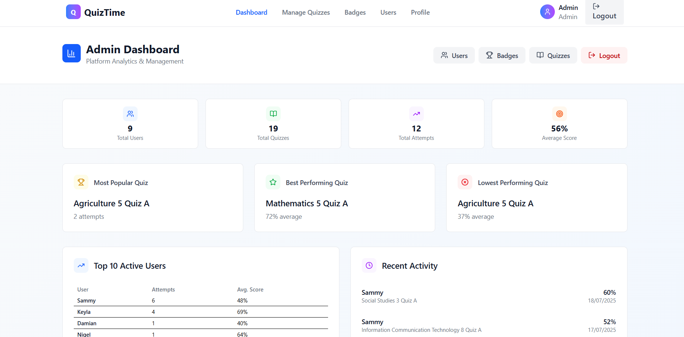
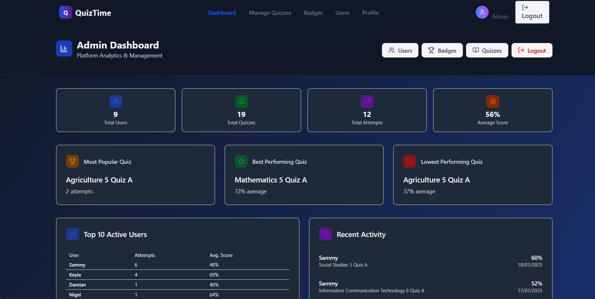
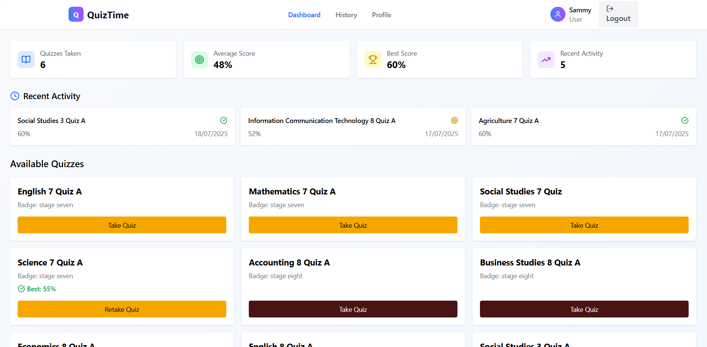
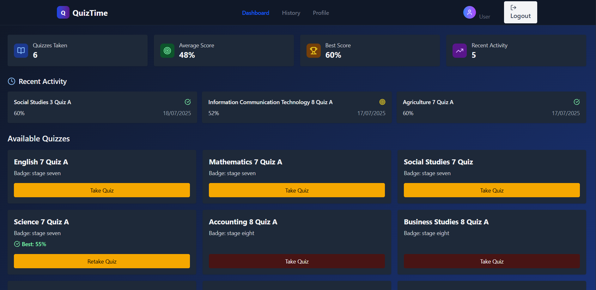
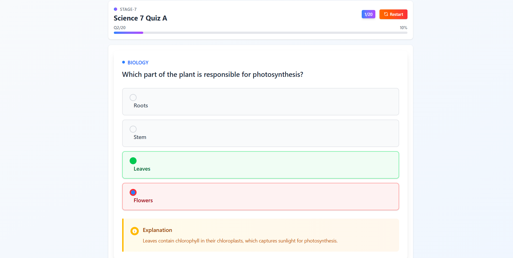
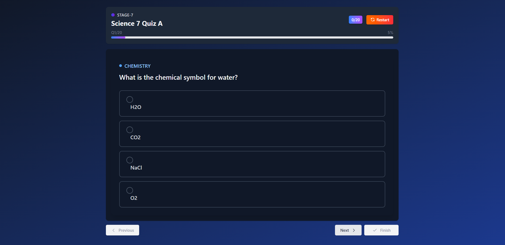
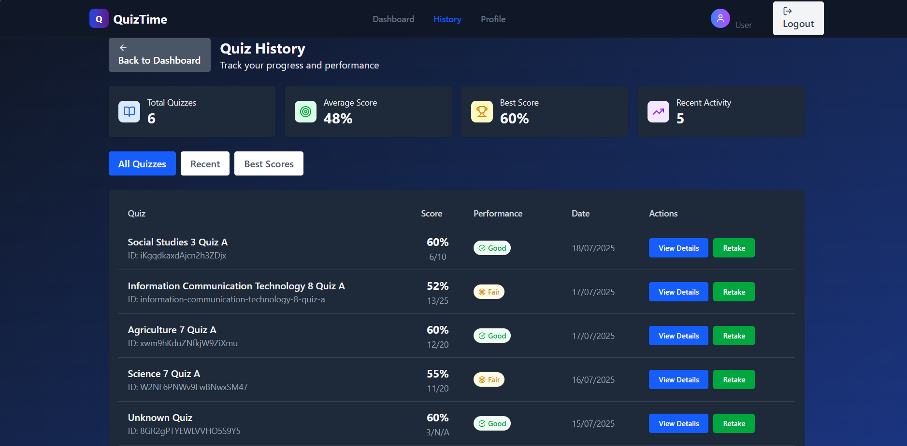
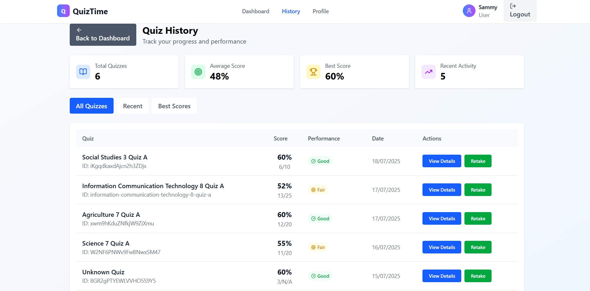

# Quiz Time 🎯

[](https://quiz-time-umber.vercel.app/)
[](LICENSE)
[](https://nodejs.org/)
[](https://www.typescriptlang.org/)

A modern, real-time quiz management and participation platform that brings interactive learning to life. Built with cutting-edge technologies for seamless user experience and robust performance.

## 🌟 Key Highlights

- **⚡ Real-time Experience**: Live quiz updates with Firebase Firestore
- **🎨 Modern UI/UX**: Beautiful dark mode with accessible design
- **🔐 Secure Authentication**: Firebase Auth with role-based access
- **📊 Analytics & Insights**: Comprehensive quiz performance tracking
- **🏆 Gamification**: Badges, leaderboards, and user achievements
- **📱 Responsive Design**: Perfect on desktop, tablet, and mobile

## 🚀 Features

### Core Functionality

- **📝 Quiz Management**: Create, edit, delete, and organize quizzes
- **👥 User Authentication**: Secure login/signup with Firebase Auth
- **⚡ Real-time Updates**: Live quiz sessions with instant feedback
- **🔍 Smart Validation**: Robust form validation with Zod schemas
- **🎯 Optimistic UI**: Fast, responsive user interactions

### User Experience

- **🌙 Dark/Light Mode**: Automatic theme switching
- **📱 Responsive Design**: Mobile-first approach
- **♿ Accessibility**: WCAG 2.1 compliant
- **🔔 Notifications**: Real-time toast notifications
- **🎨 Beautiful Gradients**: Modern visual design

### Advanced Features

- **🏆 Leaderboards**: Global and quiz-specific rankings
- **📈 Quiz History**: Detailed performance tracking
- **🎖️ Badge System**: Achievement unlocks and progress tracking
- **👑 Admin Panel**: Comprehensive quiz management dashboard
- **📊 Analytics**: Quiz completion rates and performance metrics

## 🛠️ Tech Stack

### Frontend

- **[React 18](https://react.dev/)** - Modern UI library
- **[TypeScript](https://www.typescriptlang.org/)** - Type-safe development
- **[Vite](https://vitejs.dev/)** - Lightning-fast build tool
- **[Tailwind CSS](https://tailwindcss.com/)** - Utility-first styling

### Backend & Services

- **[Firebase Auth](https://firebase.google.com/products/auth)** - Authentication
- **[Firestore](https://firebase.google.com/products/firestore)** - Real-time database
- **[Firebase Hosting](https://firebase.google.com/products/hosting)** - Deployment

### Libraries & Tools

- **[React Hook Form](https://react-hook-form.com/)** - Form management
- **[Zod](https://zod.dev/)** - Schema validation
- **[Lucide React](https://lucide.dev/)** - Beautiful icons
- **[React Hot Toast](https://react-hot-toast.com/)** - Notifications

## 🎮 Demo & Screenshots

### 🌐 Live Demo

**[Try Quiz Time Now →](https://quiz-time-umber.vercel.app/)**

**Demo Login Credentials (Regular User)**

- **Username**: `baddy@quiztime.bw`
- **Password**: `quizTime@123`
  > Use these credentials to log in as a regular user and explore available quizzes.

### 📸 Screenshots

| Feature             | Light Mode                                                                | Dark Mode                                                               |
| ------------------- | ------------------------------------------------------------------------- | ----------------------------------------------------------------------- |
| **Admin Dashboard** |    |   |
| **User Dashboard**  |     |     |
| **Quiz Taking**     |             |            |
| **User History**    |  |  |

> 💡 **Tip**: Click any screenshot to view full size

## 🚀 Quick Start

### Prerequisites

Before you begin, ensure you have:

- **Node.js** (v18 or higher) - [Download here](https://nodejs.org/)
- **npm** or **yarn** package manager
- **Firebase account** - [Create one here](https://firebase.google.com/)

### Installation

1. **Clone the repository**

   ```bash
   git clone https://github.com/mubureterrance/quiz-time.git
   cd quiz-time
   ```

2. **Install dependencies**

   ```bash
   npm install
   # or
   yarn install
   ```

3. **Set up environment variables**

   ```bash
   cp .env.example .env
   ```

   Edit `.env` with your Firebase configuration:

   ```env
   VITE_FIREBASE_API_KEY=your_api_key_here
   VITE_FIREBASE_AUTH_DOMAIN=your_project.firebaseapp.com
   VITE_FIREBASE_PROJECT_ID=your_project_id
   VITE_FIREBASE_STORAGE_BUCKET=your_project.appspot.com
   VITE_FIREBASE_MESSAGING_SENDER_ID=123456789
   VITE_FIREBASE_APP_ID=1:123456789:web:abcdef123456
   VITE_FIREBASE_MEASUREMENT_ID=G-ABCDEF1234
   ```

4. **Start the development server**

   ```bash
   npm run dev
   ```

   Open [http://localhost:5173](http://localhost:5173) in your browser.

## 🔧 Firebase Setup

### 1. Create Firebase Project

1. Go to [Firebase Console](https://console.firebase.google.com/)
2. Click "Create a project"
3. Follow the setup wizard

### 2. Enable Authentication

1. Navigate to **Authentication** > **Sign-in method**
2. Enable **Email/Password** provider
3. Configure authorized domains (add your domain for production)

### 3. Set up Firestore Database

1. Go to **Firestore Database**
2. Create database in **production mode**
3. Choose your preferred location

### 4. Configure Firestore Security Rules

```javascript
rules_version = '2';
service cloud.firestore {
  match /databases/{database}/documents {
    // Users can read/write their own data
    match /users/{userId} {
      allow read, write: if request.auth != null && request.auth.uid == userId;
    }

    // All authenticated users can read quizzes
    match /quizzes/{quizId} {
      allow read: if request.auth != null;
      allow write: if request.auth != null &&
        (resource.data.createdBy == request.auth.uid ||
         get(/databases/$(database)/documents/users/$(request.auth.uid)).data.role == 'admin');
    }

    // Users can read/write their own quiz results
    match /quizResults/{resultId} {
      allow read, write: if request.auth != null &&
        resource.data.userId == request.auth.uid;
    }

    // All authenticated users can read badges
    match /badges/{badgeId} {
      allow read: if request.auth != null;
      allow write: if request.auth != null &&
        get(/databases/$(database)/documents/users/$(request.auth.uid)).data.role == 'admin';
    }
  }
}
```

### 5. Create Initial Collections

The app will automatically create collections, but you can manually create:

- `users` - User profiles and settings
- `quizzes` - Quiz data and questions
- `quizResults` - Quiz attempt results
- `badges` - Achievement badges

## 📁 Project Structure

```
quiz-time/
├── 📁 public/                 # Static assets
├── 📁 src/
│   ├── 📁 components/         # React components
│   │   ├── 📁 ui/            # Reusable UI components
│   │   ├── 📁 forms/         # Form components
│   │   └── 📁 layout/        # Layout components
│   ├── 📁 pages/             # Page components
│   │   ├── 📄 Dashboard.tsx
│   │   ├── 📄 QuizTaking.tsx
│   │   └── 📄 Profile.tsx
│   ├── 📁 hooks/             # Custom React hooks
│   │   ├── 📄 useAuth.ts
│   │   ├── 📄 useQuizzes.ts
│   │   └── 📄 useRealtime.ts
│   ├── 📁 services/          # API and external services
│   │   ├── 📄 firebase.ts
│   │   ├── 📄 auth.ts
│   │   └── 📄 firestore.ts
│   ├── 📁 schemas/           # Zod validation schemas
│   │   ├── 📄 quiz.ts
│   │   └── 📄 user.ts
│   ├── 📁 types/             # TypeScript type definitions
│   ├── 📁 utils/             # Utility functions
│   └── 📄 App.tsx           # Main app component
├── 📄 package.json
├── 📄 vite.config.ts
├── 📄 tailwind.config.js
├── 📄 tsconfig.json
└── 📄 README.md
```

## 🎨 Customization

### Theming

The app uses Tailwind CSS with custom color schemes:

```css
/* Custom colors in tailwind.config.js */
module.exports = {
  theme: {
    extend: {
      colors: {
        primary: {
          50: '#eff6ff',
          500: '#3b82f6',
          600: '#2563eb',
          700: '#1d4ed8',
        }
      }
    }
  }
}
```

### Dark Mode

Dark mode is automatically handled by Tailwind's `dark:` prefix:

```jsx
<div className="bg-white dark:bg-gray-900 text-gray-900 dark:text-white">
  Content adapts to theme
</div>
```

## 🧪 Testing

### Running Tests

```bash
# Run unit tests
npm run test

# Run tests with coverage
npm run test:coverage

# Run e2e tests
npm run test:e2e
```

### Test Structure

```
src/
├── 📁 __tests__/
│   ├── 📄 components/
│   ├── 📄 hooks/
│   └── 📄 utils/
└── 📄 setupTests.ts
```

## 🚀 Deployment

### Vercel (Recommended)

1. Push code to GitHub
2. Connect repository to [Vercel](https://vercel.com/)
3. Add environment variables in Vercel dashboard
4. Deploy automatically on push

### Firebase Hosting

```bash
# Install Firebase CLI
npm install -g firebase-tools

# Login to Firebase
firebase login

# Initialize hosting
firebase init hosting

# Build and deploy
npm run build
firebase deploy
```

### Manual Build

```bash
# Build for production
npm run build

# Preview build locally
npm run preview
```

## 📊 Performance & Analytics

### Performance Optimizations

- **Code Splitting**: Automatic route-based splitting
- **Lazy Loading**: Components loaded on demand
- **Image Optimization**: Responsive images with lazy loading
- **Firebase Caching**: Optimized Firestore queries

### Analytics Integration

The app supports Google Analytics 4 integration:

```javascript
// Add to firebase.ts
import { getAnalytics } from "firebase/analytics";

const analytics = getAnalytics(app);
```

## 🔒 Security Best Practices

### Implemented Security Features

- **Firebase Security Rules**: Proper data access control
- **Input Validation**: Zod schemas for all forms
- **XSS Protection**: React's built-in protections
- **HTTPS Only**: Secure connections enforced
- **Environment Variables**: Sensitive data protection

### Additional Security Recommendations

- Regular dependency updates
- Security headers configuration
- Rate limiting for API calls
- User input sanitization

## 🤝 Contributing

We welcome contributions! Here's how to get started:

### Development Setup

1. Fork the repository
2. Create a feature branch: `git checkout -b feature/amazing-feature`
3. Make changes and add tests
4. Commit changes: `git commit -m 'Add amazing feature'`
5. Push to branch: `git push origin feature/amazing-feature`
6. Open a Pull Request

### Code Style

- Use TypeScript for type safety
- Follow React best practices
- Use Tailwind CSS for styling
- Write meaningful commit messages
- Add tests for new features

### Reporting Issues

- Use the GitHub issue tracker
- Include detailed reproduction steps
- Add screenshots for UI issues
- Specify browser and device information

## 📋 Roadmap

### Upcoming Features

- [ ] **Real-time Multiplayer**: Live quiz competitions
- [ ] **Advanced Analytics**: Detailed quiz insights
- [ ] **Question Bank**: Reusable question library
- [ ] **Team Competitions**: Group quiz challenges
- [ ] **Video Integration**: Video-based quiz questions
- [ ] **AI-Powered Questions**: Automated question generation
- [ ] **Mobile App**: Native iOS/Android apps
- [ ] **API Integration**: Third-party quiz imports

### Long-term Vision

- LMS integration capabilities
- Corporate training modules
- Certification programs
- Advanced reporting tools

## 📞 Support & Community

### Get Help

- **Documentation**: [Wiki](https://github.com/mubureterrance/quiz-time/wiki)
- **Issues**: [GitHub Issues](https://github.com/mubureterrance/quiz-time/issues)
- **Discussions**: [GitHub Discussions](https://github.com/mubureterrance/quiz-time/discussions)

### Stay Updated

- ⭐ Star the repository
- 👀 Watch for updates
- 🐛 Report bugs
- 💡 Suggest features

## 📄 License

This project is licensed under the MIT License - see the [LICENSE](LICENSE) file for details.

## 🙏 Acknowledgments

- **Firebase Team** for the amazing backend services
- **Vercel** for seamless deployment
- **Tailwind CSS** for the utility-first approach
- **React Community** for the excellent ecosystem
- **Contributors** who help improve the project

## 👨‍💻 Author

**Terrance T Mubure**

- GitHub: [@mubureterrance](https://github.com/mubureterrance)
- LinkedIn: [Terrance Mubure](https://www.linkedin.com/in/terrance-mubure-90662370/)
- Twitter: [@mubureterrance](https://x.com/mubureterrance)

---

<div align="center">
  <p>Built with ❤️ by Terrance T Mubure</p>
  <p>
    <a href="https://quiz-time-umber.vercel.app/">Live Demo</a> •
    <a href="https://github.com/mubureterrance/quiz-time/issues">Report Bug</a> •
    <a href="https://github.com/mubureterrance/quiz-time/issues">Request Feature</a>
  </p>
</div>
